# coursework-labor-exchange-var5
Обєктно-орієнтоване програмування, Курсова робота, 5 варіант, Еленгаупт Олександр Володимирович, ПІ-221Б

Нижче показаний функціонал програми:

# Головне меню у програмі
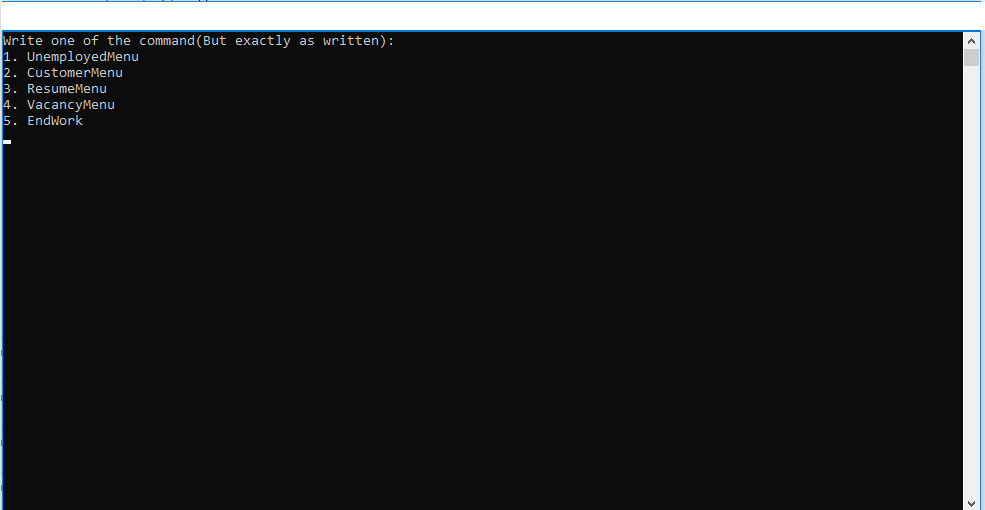

# Меню для роботи з безробітними
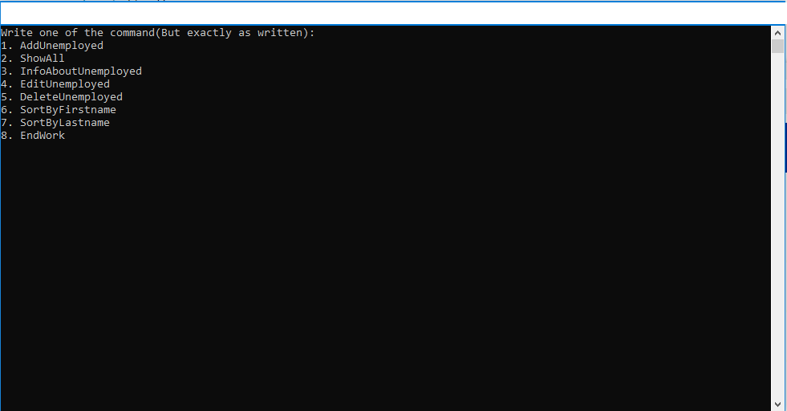

# Добавлення безробітного до списка
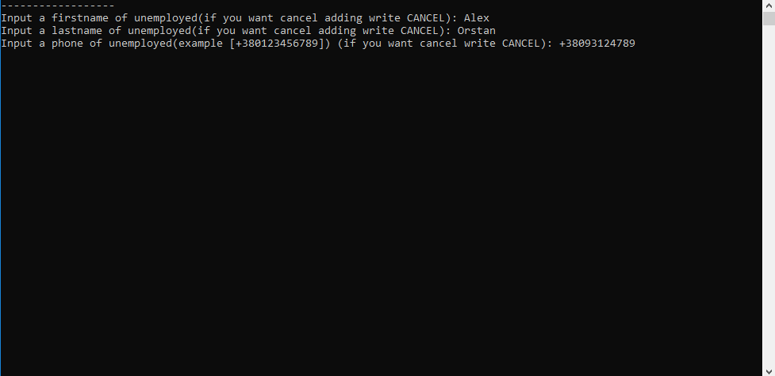

# Показ всіх безробітних
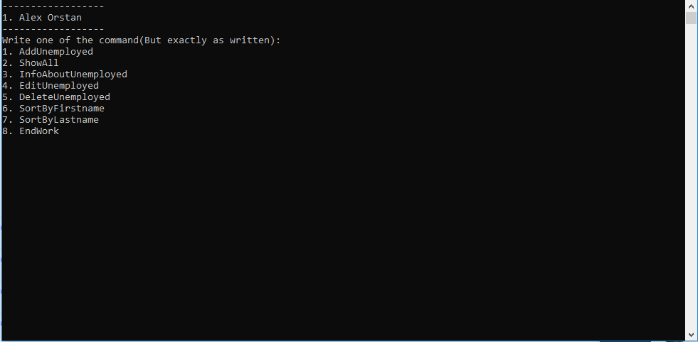

# Більше інофрмації про безробітного
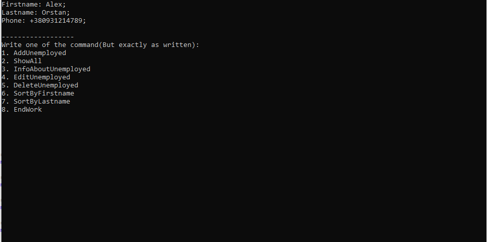

# Меню для замовника
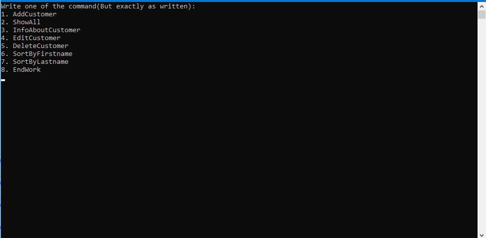

# Добавлення замовника
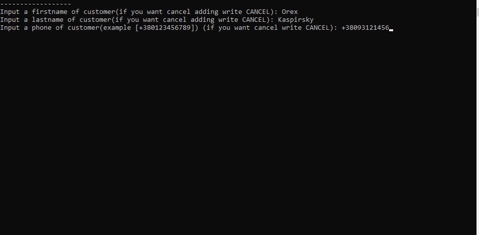

# Показ всіх замовників
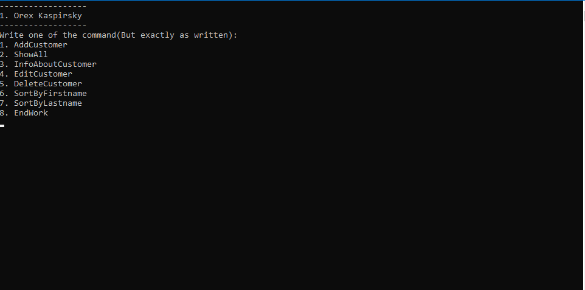

# Додаткова інформація про замовника
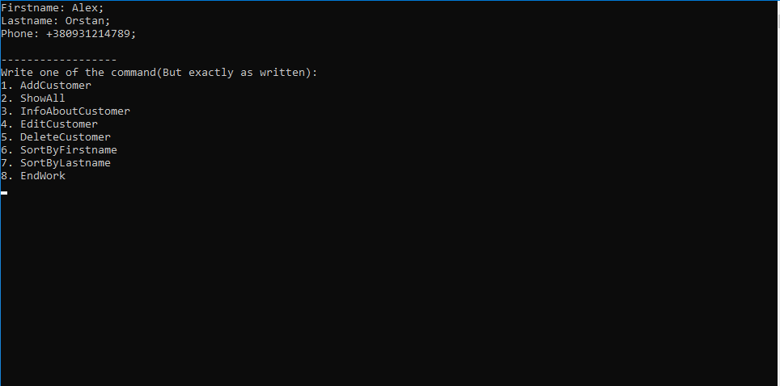

# Редагування даних про замовника
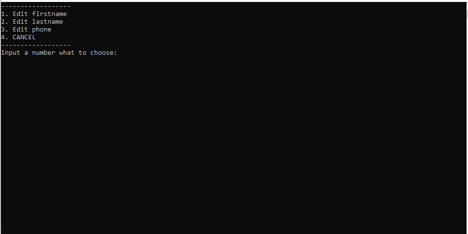

# Вибір замовника для його видалення
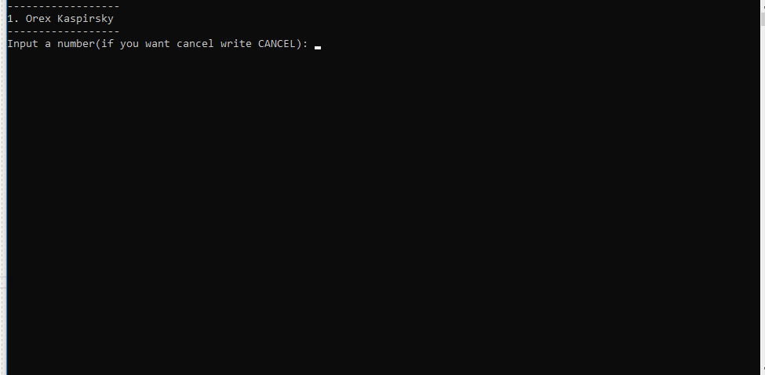

# Меню для резюме
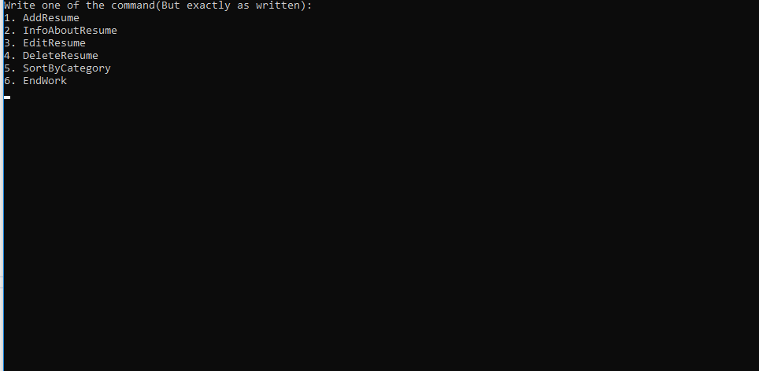

# Добавлення резюме до списка
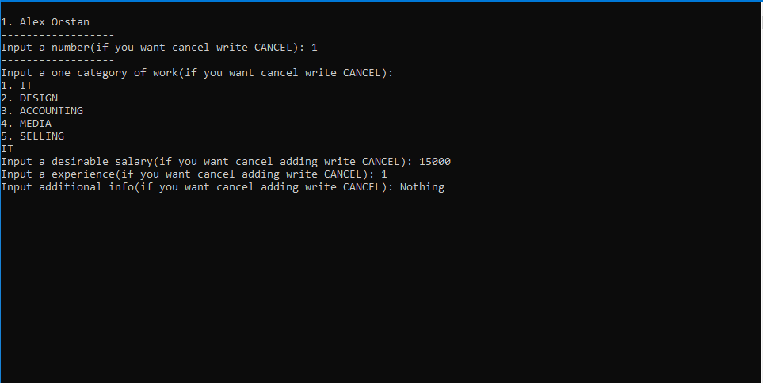

# Інформація про резюме
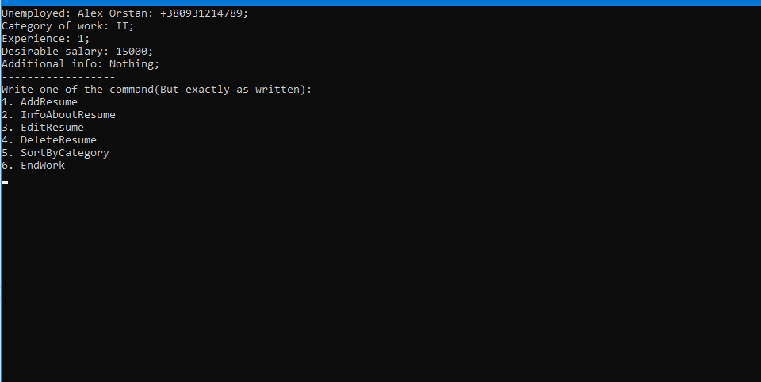

# Меню для вакансій
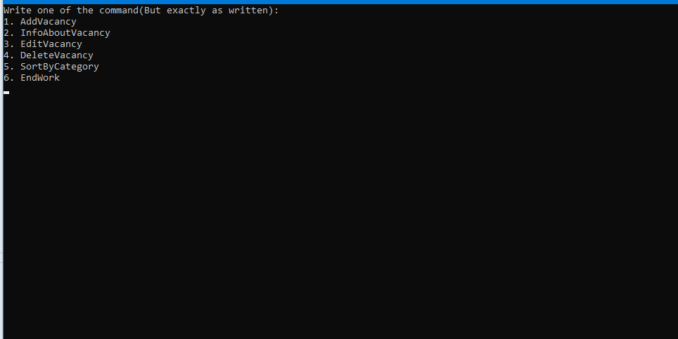

# Добавлення вакансії до списків
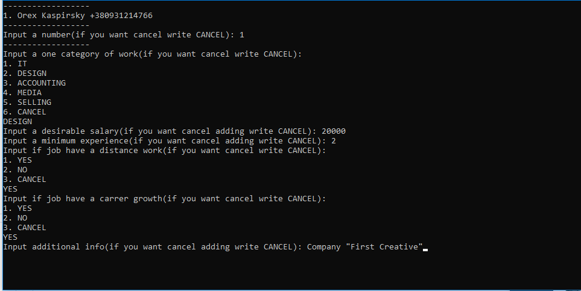

# Інформація про вакансію
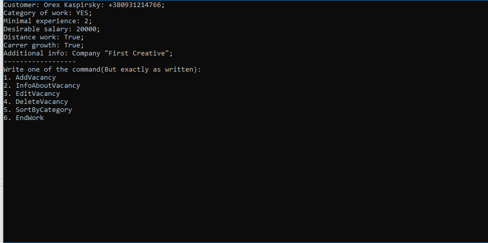

# Редагування параметрів вакансії
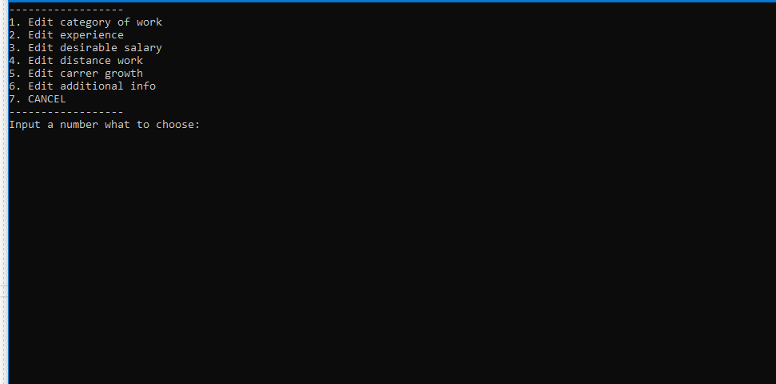
